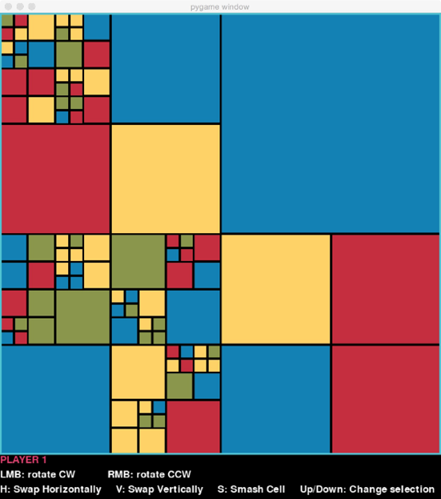
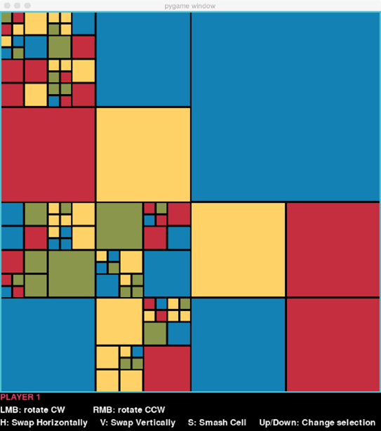
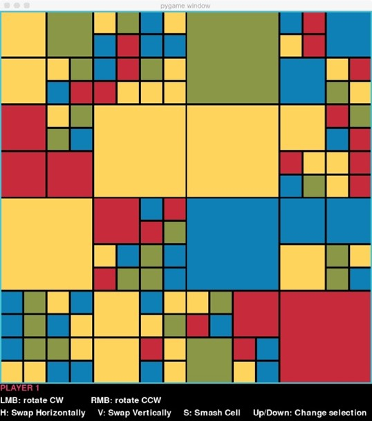
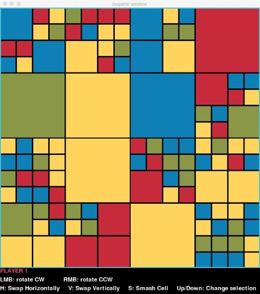
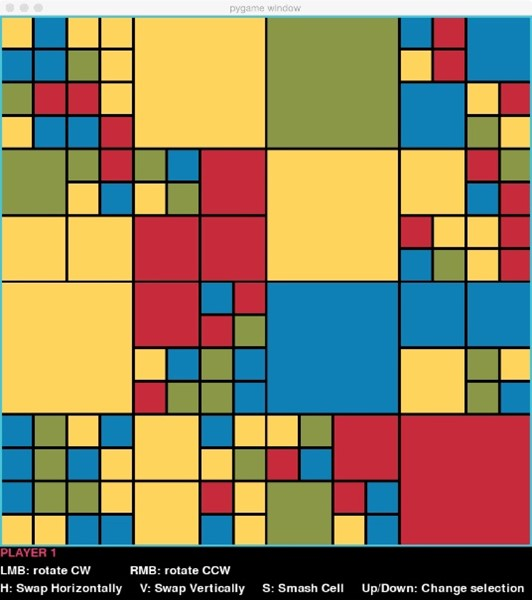
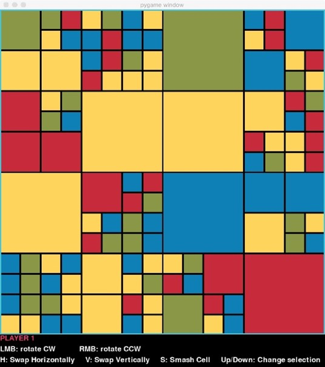
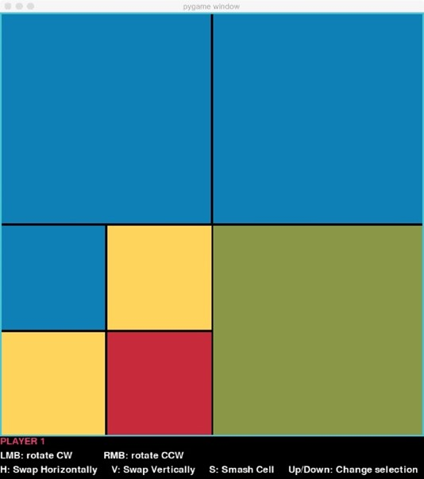
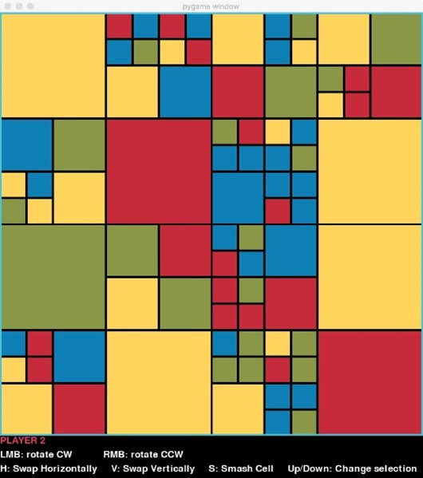
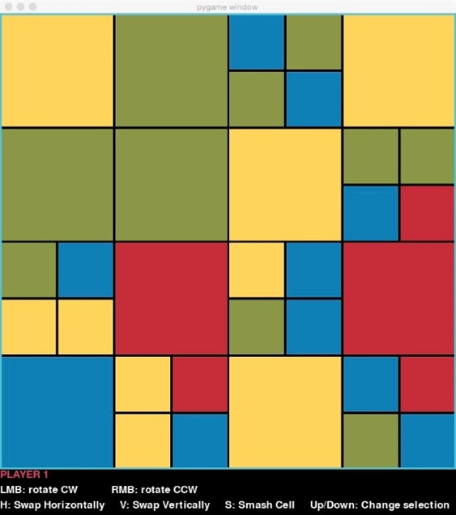
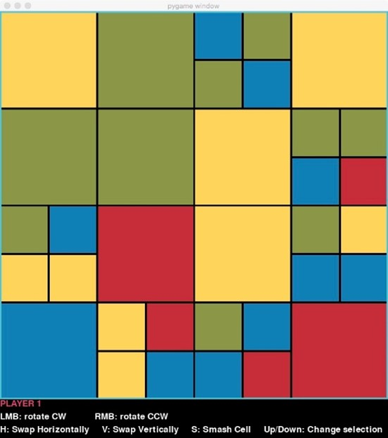

# Blocky

## 1. Objetivos de aprendizaje
Al finalizar esta tarea, deberías ser capaz de:

- Modelar datos jerárquicos usando árboles.
- Implementar operaciones recursivas en árboles (tanto mutables como inmutables).
- Convertir un árbol en una estructura plana y bidimensional.
- Utilizar herencia para diseñar clases de acuerdo con una interfaz común.

## 2. Introducción
Blocky es un juego con movimientos simples sobre una estructura sencilla, pero, al igual
que el Cubo de Rubik, es bastante desafiante de jugar. El juego se juega en un tablero
generado aleatoriamente, compuesto por cuadrados de cuatro colores diferentes, como este:

Cada jugador tiene su propio objetivo, como crear el "bloque" de color azul más 
grande posible. Después de cada movimiento, el jugador ve su puntuación, determinada 
por qué tan bien ha logrado su objetivo. El juego continúa durante un número determinado 
de turnos, y el jugador con la puntuación más alta al final es el ganador.

Ahora, veamos en más detalle las reglas del juego y las diferentes formas en que se puede 
configurar para jugar.

### 2.1 El tablero de Blocky

Llamamos "bloque" al tablero del juego. Se define mejor de manera recursiva. Un bloque es:

- Un cuadrado de un solo color, o
- Un cuadrado subdividido en 4 bloques de igual tamaño.

El bloque más grande de todos, que contiene toda la estructura, se llama el **bloque de nivel 
superior**. Decimos que este bloque está en el **nivel 0**. Si el bloque de nivel superior está 
subdividido, sus cuatro sub-bloques están en el **nivel 1**. De manera más general, si un bloque 
en el nivel k está subdividido, sus cuatro sub-bloques estarán en el **nivel k+1**.

Un tablero de Blocky tiene una **profundidad máxima permitida**, que es el número de niveles que 
puede alcanzar. Un tablero con una profundidad máxima de 0 no sería divertido, ya que no podría 
subdividirse más allá del nivel superior, lo que significaría que todo el tablero sería de un solo
color.

Este tablero fue generado con una profundidad máxima de 5:

Para la puntuación, las unidades de medida son cuadrados del tamaño de los bloques en la profundidad
máxima permitida. Llamaremos a estos bloques celdas unitarias.

### 2.2 Elegir un bloque y niveles

Los movimientos que se pueden realizar incluyen acciones como rotar un bloque. Lo que hace interesantes 
estos movimientos es que pueden aplicarse a cualquier bloque en cualquier nivel. Por ejemplo, si el 
usuario selecciona todo el bloque de nivel superior en este tablero:

y elige rotarlo en sentido antihorario, el tablero resultante es el siguiente:

Pero si en lugar de eso, en el tablero original, rotaran el bloque en el nivel 1 (un nivel por debajo del
bloque de nivel superior) ubicado en la esquina superior izquierda, el tablero resultante sería el 
siguiente:

Y si en su lugar rotaran el bloque un nivel más abajo, manteniéndose en la esquina superior izquierda, 
obtendrían lo siguiente:

Por supuesto, hay muchos otros bloques dentro del tablero, en varios niveles, que el jugador podría haber 
elegido.

### 2.3 Movimientos

Estos son los movimientos permitidos en un tablero de Blocky:

- **Rotar** el bloque seleccionado, ya sea en sentido horario o antihorario.
- **Intercambiar** los 4 sub-bloques dentro del bloque seleccionado, ya sea de forma horizontal o vertical.
- **Romper (Smash)** el bloque seleccionado, ya sea un bloque de un solo color o uno que ya esté subdividido,
se reemplaza con cuatro nuevos sub-bloques generados aleatoriamente. **No se permite romper el bloque de nivel
superior**, ya que eso crearía un juego completamente nuevo. Tampoco se permite romper una **celda unitaria**,
porque ya está en la profundidad máxima permitida.

### 2.4 Objetivos y puntuación
Al inicio del juego, a cada jugador se le asigna un objetivo generado aleatoriamente. Hay dos tipos de 
objetivos:

1.	**Objetivo de bloque (Blob goal).** El jugador debe intentar formar el **bloque más grande** de un color 
específico c. Un bloque es un grupo de celdas conectadas del mismo color. Dos celdas están conectadas 
si sus lados se tocan; el contacto en las esquinas no cuenta. La puntuación del jugador es el número 
de **celdas unitarias** en el bloque más grande del color c.
2. **Objetivo de perímetro (Perimeter goal).** El jugador debe tratar de colocar la mayor cantidad 
posible de celdas de un color específico c en el **perímetro exterior** del tablero. La puntuación del 
jugador es el número total de **celdas unitarias** del color c en el perímetro. **Las celdas en las 
esquinas valen el doble.**

En ambos casos, el objetivo está relacionado con un **color específico**, al que llamaremos **color objetivo**.

### 2.5 Jugadores

El juego puede jugarse en solitario (con un solo jugador) o con dos o más jugadores. No hay un límite definido 
en la cantidad de jugadores, aunque no sería divertido con un número demasiado grande.

Existen tres tipos de jugadores:
1. Jugador humano:
   - Elige sus movimientos según la entrada del usuario.
   - **Solo puede realizar un movimiento de "romper" (smash) por partida.**
2. Jugador aleatorio:
   - Es un jugador controlado por la computadora que elige movimientos de manera aleatoria.
   - No tiene límite en los movimientos de "romper".
   - Si selecciona aleatoriamente "romper" el bloque de nivel superior o una celda unitaria (lo cual no está permitido),
   pierde su turno.
3. Jugador inteligente:
   - Es un jugador controlado por la computadora que elige sus movimientos de manera estratégica.
   - Genera un conjunto de movimientos aleatorios y evalúa la puntuación que obtendría con cada uno.
   - Elige el movimiento que le daría la **mayor puntuación posible**.
   - **No puede realizar movimientos de "romper" (smash)**.

### 2.6 Configuraciones del juego

Un juego de Blocky puede configurarse de varias maneras:
- **Profundidad máxima permitida:**
  - Aunque el patrón de colores del tablero se genera aleatoriamente, se puede controlar el nivel de 
  subdivisión de los bloques.
- **Número y tipo de jugadores:**
  -	Puede haber cualquier cantidad de jugadores de cada tipo.
  - La dificultad del jugador inteligente (**qué tan difícil es jugar contra él**) también puede configurarse.
- **Número de movimientos:**
  -	Se puede establecer un límite de movimientos para la partida.
  -	(El juego terminará antes si un jugador cierra la ventana del juego).

## 3. Configuración y código inicial

En el repositorio encontrarás los siguientes archivos:

- `block.py`
- `game.py`
- `goal.py`
- `player.py`
- `renderer.py` (No modifiques este archivo. Todo tu trabajo se realizará en los otros archivos).
- `rectangle_test.py` (Te ayudará a probar get_draw_rectangles).
- `simple_test.py` (Incluye una prueba sencilla para cada uno de los métodos que podemos probar automáticamente).

Haz un fork del repositorio y clona tu fork en tu computadora.

## 4. Actividades

### 4.1 Tarea 1: Comprender la estructura de datos del Bloque

Como era de esperarse, utilizaremos un **árbol** para representar la estructura 
anidada de un bloque. Sin embargo, nuestros árboles tienen algunas **restricciones 
estrictas** en su estructura y contenido:

- Un nodo no puede tener exactamente tres hijos.
  - Un bloque es de **un solo color** o está **subdividido en exactamente cuatro sub-bloques**.
  - Si es de un solo color, se representa con un nodo **sin sub-bloques**.
  - Si está subdividido, debe tener exactamente **cuatro sub-bloques**.

Estas reglas, junto con otros detalles importantes, están documentadas en los 
**invariantes de representación** de la clase `Block`.

#### Instrucciones

- Abre `block.py` y lee detenidamente los docstring de la clase.
- Familiarízate con los atributos de un `Block`.
- Presta especial atención a los invariantes de representación.
- Dibuja la estructura del árbol correspondiente al siguiente tablero de juego, suponiendo 
que la profundidad máxima es 2 (y que se ha alcanzado).
  - Usa una letra para representar cada color.
  - Asume que el tamaño del bloque de nivel superior es 750.
  

### 4.2 Tarea 2: Inicializar Bloques y Dibujarlos

Ahora que tienes una buena comprensión de la estructura de datos, estás listo para comenzar 
a implementar la clase `Block`.

#### Paso 1: Implementar `__init__`

Debes escribir el método de inicialización `__init__` de la clase `Block`.

Este método debe:
- Inicializar los atributos de un bloque de acuerdo con los invariantes de representación.
- Manejar correctamente los bloques de color sólido y los bloques subdivididos en cuatro sub-bloques.

#### Paso 2: Implementar `random_init`

Dado que crear manualmente bloques interesantes sería muy tedioso, necesitamos una forma de generar 
tableros de juego de manera aleatoria. Para eso, implementaremos la función `random_init`, que se 
encuentra fuera de la clase `Block`, ya que no necesita referirse a `self`.

Estrategia para `random_init`:

1. Si un bloque no ha alcanzado la profundidad máxima, puede subdividirse. 
2. Para decidir si se subdivide, haz lo siguiente:
   - Usa `random.random()` para generar un número aleatorio en el intervalo `[0, 1)`.
   - Si el número generado es menor que `math.exp(-0.25 * level)`, entonces el bloque se subdivide en cuatro sub-bloques.
3. Si el bloque no se subdivide, elige un color aleatorio de la lista `renderer.COLOUR_LIST`.

💡 Nota:
- La profundidad máxima no siempre se alcanzará en la generación aleatoria, ya que depende 
de los valores aleatorios obtenidos.
- `random_init` debe asignar todos los atributos de los bloques generados, excepto `position` 
y `size`, que serán establecidos en el siguiente paso.
- `random_init` puede hacer su trabajo casi por completo mediante llamadas al inicializador `__init__` de `Block`.

#### Paso 3: Definir el método `update_block_locations`

Este método actualiza los valores de los atributos `position` y `size` en todos los bloques de un `Block`, 
asegurando que sean consistentes con los invariantes de representación de la clase.

Ten en cuenta que la posición y el tamaño de un `Block` se determinan por la posición y el tamaño de su bloque padre.

#### Paso 4: Hacer que un bloque sea dibujable con `rectangles_to_draw`

Para que un `Block` pueda ser dibujado, debemos proporcionar una lista de rectángulos al **renderer**.

Escribe el método `rectangles_to_draw`.

Aún no podemos modificar un `Block`, pero tendremos lo suficiente para recorrer los pasos de un juego 
una vez que definamos al menos un tipo de `Player` y `Goal`, y preparemos la clase `Game`.

**Verifica tu trabajo:**

Proporcionaremos una función llamada `print_block`, que imprimirá el contenido de un `Block` en formato de 
texto. Usa esta función para confirmar que tus implementaciones de `__init__` y `random_init` funcionan correctamente.

También proporcionaremos código de **pytest** para probar tu método `get_draw_rectangles`.
Podrás probar `get_selected_block` una vez que el juego esté en funcionamiento.

### 4.3 Tarea 3: Completar las clases básicas de objetivos

Necesitamos establecer algunos objetivos básicos y calcular la puntuación de un jugador en
relación con su objetivo.

1. Abre `goal.py` y familiarízate con la interfaz de la clase abstracta `Goal`.
   - Esta clase contiene la infraestructura básica para almacenar la información de cualquier objetivo.
   - Define los métodos abstractos `score` y `description`, que deben ser implementados por cualquier subclase.
2. Define las clases de objetivos específicos:
   - `BlobGoal` (ya está iniciada en el código).
   - `PerimeterGoal`.

Por ahora, **todos los objetivos deben devolver el mismo valor para `score`**, 
sin importar el estado del tablero. ¿Qué tal 148?

📌 **Nota:** Ignora el método `_undiscovered_blob_size` por ahora; lo implementarás cuando 
desarrolles el sistema de puntuación real.

### 4.4 Tarea 4: Completar la clase `Game`

¡Ahora tenemos suficientes elementos para armar un juego rudimentario!

1. Abre `game.py` y revisa la docstring de la clase `Game`. Asegúrate de comprender todos sus atributos.
2. Esta clase solo tiene dos métodos, y ya hemos implementado el método `run_game` por ti. 
Implementa el inicializador. Debe hacer lo siguiente:
   - Crear un Renderer para este juego.
   - Generar un tipo de objetivo aleatorio que compartirán todos los jugadores.
   - Generar un tablero aleatorio con la profundidad máxima dada.
   - Generar el número correcto de jugadores humanos, jugadores aleatorios y jugadores 
   inteligentes (con los niveles de dificultad dados), en ese orden.
   - Asignar a los jugadores números consecutivos, comenzando en 0.
   - Asignar a cada jugador un color objetivo aleatorio y mostrar su objetivo.
   - Antes de retornar, dibujar el tablero. 
3. Hemos escrito una clase abstracta `Player` y una subclase `HumanPlayer` para ti. Para que el usuario 
pueda jugar, debe poder seleccionar un bloque para una acción (como rotarlo) pasando el cursor sobre 
el tablero y usando las flechas arriba y abajo para elegir un nivel. En `block.py`, 
el método `get_selected_block` toma estas entradas del usuario y encuentra el `Block` correspondiente 
dentro del árbol. Implementa ese método.

**Verifica tu trabajo:**

Deberías poder ejecutar un juego con solo jugadores humanos. Prueba ejecutando el método `two_player_game`; 
puedes descomentar la llamada a este en el bloque principal del módulo `game`. Para seleccionar un bloque 
para una acción, coloca el cursor dentro de él y usa las flechas arriba y abajo para elegir el nivel deseado.

El área en la parte inferior del tablero del juego te indicará cómo seleccionar una acción.

Hasta ahora, no se están realizando movimientos reales y la puntuación no cambia, pero deberías poder 
ver el tablero, notar cómo los turnos alternan entre los jugadores (indicado por la etiqueta roja 
"PLAYER n" debajo del tablero) y ver que el juego termina cuando se alcanza el número de movimientos deseado.

### 4.5 Tarea 5: Hacer que los `Block` sean mutables

Hagamos que el juego sea real permitiendo que los jugadores realicen movimientos en el tablero.

1. Revisa los invariantes de representación de la clase Block. Son fundamentales para el correcto 
funcionamiento del programa, y todos los métodos de la clase deben asegurarse de que se mantengan.
2. Define los métodos swap, rotate y smash. Asegúrate de que cada uno de ellos llame a `update_block_locations` 
antes de retornar.
3. Verifica que cada uno de los métodos que modifican el estado de los `Block` mantiene los invariantes 
de representación de la clase `Block`.

**Verifica tu trabajo:**

Ahora, cuando juegues, deberías ver que el tablero cambia con los movimientos. Puede ser más fácil 
usar la función `solitaire_game` para probar los diferentes movimientos.

### 4.6 Tarea 6: Implementar la puntuación para los objetivos de perímetro

Ahora hagamos que el sistema de puntuación funcione.

La unidad que usamos para calcular la puntuación en relación con un objetivo es una **celda unitaria**. 
El tamaño de una celda unitaria depende de la **profundidad máxima** en el `Block`.

Por ejemplo, con una profundidad máxima de 4, podríamos obtener este tablero:

Si cuentas hacia abajo a través de los niveles, verás que los bloques más pequeños están en el nivel 4. 
Esos bloques son celdas unitarias.

Sería posible generar ese mismo tablero incluso si la profundidad máxima fuera 5. En ese caso, 
las celdas unitarias serían de un tamaño más pequeño, aunque ningún `Block` se haya dividido hasta ese nivel.

Ten en cuenta que el **perímetro** puede incluir celdas unitarias del color objetivo, así como bloques 
más grandes de ese mismo color. Para un bloque más grande, solo cuentan **las porciones del tamaño de una 
celda unitaria** que estén en el perímetro.

Por ejemplo, supongamos que la profundidad máxima es 3, el color objetivo es rojo y el tablero está en este estado:

Solo los bloques rojos en el borde contribuirían a la puntuación, que sería 4:
- Uno por cada una de las dos celdas unitarias en el borde derecho.
- Dos por las celdas unitarias dentro del bloque rojo más grande que están realmente en el borde.

(Nota que el bloque rojo más grande **no está dividido en cuatro celdas unitarias**, pero aun así 
puntuamos como si lo estuviera).

Recuerda que las **celdas en las esquinas cuentan el doble en la puntuación**.
Entonces, si el jugador rotara el bloque inferior derecho para colocar el bloque rojo grande en la esquina:

La puntuación aumentaría a 6.

Ahora que entendemos estos detalles sobre la puntuación para un objetivo de perímetro, podemos implementarlo.

Calcular la puntuación para un objetivo de perímetro o un objetivo de bloque recorriendo la estructura del árbol 
es muy difícil. (¡Piénsalo bien!). Es mucho **más fácil evaluar los objetivos recorriendo una representación 
bidimensional** del tablero de juego.

Tu próxima tarea es proporcionar esa posibilidad:
- En el módulo block, define el método flatten.
- Vuelve a implementar el método score en la clase PerimeterGoal para calcular la puntuación correctamente. 
Comienza aplanando el tablero (flatten) para facilitar el cálculo.

**Verifica tu trabajo:**

Ahora, cuando juegues, si un jugador tiene un objetivo de perímetro, deberías ver cómo cambia la puntuación.

Confirma que la puntuación se actualiza correctamente.

### 4.7 Tarea 7: Implementar la puntuación para los objetivos de bloque (Blob Goals)

Calcular la puntuación con un objetivo de bloque implica aplanar el árbol, recorrer las celdas 
en el tablero aplanado y determinar, para cada celda, el tamaño del bloque al que pertenece 
(si es que forma parte de un bloque del color objetivo). La puntuación es el tamaño del bloque 
más grande encontrado.

Pero, ¿cómo determinamos el tamaño del bloque al que pertenece una celda? (Parece que necesitaremos
un método auxiliar, ¿verdad?) Comenzaremos desde la celda dada y:

- Si no es del color objetivo, entonces no forma parte de un bloque de ese color, por lo que
debe reportar un tamaño de 0.
- Si es del color objetivo, entonces forma parte de un bloque de ese color. Puede ser un bloque 
muy pequeño que solo contenga esa celda o uno más grande. Debe preguntar a sus vecinos por el 
tamaño del bloque al que pertenecen y usar esa información para determinar su propio tamaño. 
(Parece recursivo, ¿verdad?)

Un problema potencial es que cuando preguntamos a un vecino por el tamaño de su bloque, este 
puede incluirnos en su cálculo, lo que haría que la celda se cuente dos veces (o más). Para 
evitar estos problemas, llevaremos un registro de las celdas que han sido **"visitadas"** 
por el algoritmo. Para ello, crearemos otra estructura de lista anidada que sea exactamente 
paralela al árbol aplanado. En cada celda almacenaremos:

- -1 si la celda aún no ha sido visitada.
- 0 si ha sido visitada, pero no es del color objetivo.
- 1 si ha sido visitada y es del color objetivo.

Tu tarea es implementar este algoritmo.

1. Abre `goal.py` y lee el docstring del método auxiliar `_undiscovered_blob_size`.
2. Dibuja una cuadrícula de **4x4** con un pequeño bloque en ella y una cuadrícula 
paralela de 4x4 llena de valores -1.
3. Elige una celda dentro de tu bloque y supón que llamamos a **_undiscovered_blob_size**. 
Sigue el rastro de lo que debería hacer el método. Recuerda no desenrollar la recursión. 
Simplemente asume que cuando preguntes a un vecino por su respuesta, este lo hará correctamente 
(y actualizará la estructura de celdas visitadas correctamente).
4. Implementa `_undiscovered_blob_size`.
5. Ahora reemplaza la implementación temporal de `BlobGoal.score` por una versión real. 
Usa `_undiscovered_blob_size` como método auxiliar.

Aunque solo tenemos dos tipos de objetivos, puedes notar que agregar un nuevo tipo de objetivo, 
como conectar un color en diagonal, solo requeriría definir una nueva subclase de `Goal`, 
implementar el método score para ese objetivo y actualizar el código que configura el juego para 
incluir el nuevo objetivo como una posibilidad.

**Verifica tu trabajo:**

Ahora, cuando juegues, la puntuación de un jugador debería actualizarse después de cada movimiento,
independientemente del tipo de objetivo que tenga.

### 4.8 Tarea 8: Agregar jugadores aleatorios e inteligentes

1. Dentro de `player.py`, implementa la clase `RandomPlayer`. El método `make_move` debe hacer 
lo siguiente:
   - Elegir un bloque aleatorio.
   - Resaltar el bloque elegido y dibujar el tablero.
   - Llamar a `pygame.time.wait(TIME_DELAY)` para introducir una pausa y que el usuario vea lo que está ocurriendo.
   - Elegir aleatoriamente uno de los 5 tipos de acción posibles y aplicarlo al bloque seleccionado.
   - Quitar el resaltado del bloque elegido y volver a dibujar el tablero.

2. Implementa la clase `SmartPlayer`.

    Un `SmartPlayer` tiene un nivel de dificultad, que indica qué tan difícil es jugar contra él.

   - El nivel de dificultad es un número entero >= 0, que determina cuántos movimientos posibles 
   compara antes de elegir uno.
   - Si la dificultad es 0, compara 5 posibles movimientos.
   - Consulta la siguiente tabla para conocer los valores correspondientes a otros niveles de dificultad:
   
   | Dificultad | Movimientos a comparar |
   |:----------:|:----------------------:|
   |     0      |           5            |
   |     1      |           10           |
   |     2      |           25           |
   |     3      |           50           |
   |     4      |          100           |
   |     5      |          150           |
   |     >5     |          150           |

   - Al generar estos movimientos aleatorios para comparar, recuerda que un SmartPlayer no puede hacer smash.
        
   Para evaluar cada uno de los posibles movimientos y elegir el mejor, el SmartPlayer debe:
     
   - Aplicar el movimiento, calcular la puntuación y luego deshacer el movimiento.
   - Ninguno de estos cambios debe mostrarse en la pantalla, ya que el renderer no actualizará el tablero 
   mientras esto ocurre.
        
   El método `make_move` debe hacer lo siguiente:
     
   - Evaluar la cantidad correcta de movimientos posibles y elegir el mejor entre ellos.
   - Resaltar el bloque involucrado en el movimiento elegido y dibujar el tablero.
   - Llamar a `pygame.time.wait(TIME_DELAY)` para introducir una pausa y que el usuario vea lo que está ocurriendo.
   - Aplicar el movimiento elegido.
   - Quitar el resaltado del bloque involucrado en el movimiento y volver a dibujar el tablero.

**Verifica tu trabajo:**

Ahora puedes ejecutar juegos con todos los tipos de jugadores.
 
## Pulir el código

Tómate un tiempo para perfeccionar tu código. Este paso mejorará tu calificación, pero también 
se siente muy bien. Aquí hay algunas cosas que puedes hacer:

- Presta atención a cualquier violación de las directrices de estilo PEP8 que PyCharm señale. ¡Corrígelas!
- Lee y mejora tus comentarios internos para que sean más claros y útiles.
- Elimina cualquier código que hayas agregado solo para depuración, como sentencias print.
- Elimina cualquier sentencia pass en los lugares donde ya hayas agregado el código necesario.
- Elimina la palabra "TODO" en cualquier parte donde ya hayas completado la tarea.
- ¡Siéntete orgulloso de tu código impecable! 🎉

